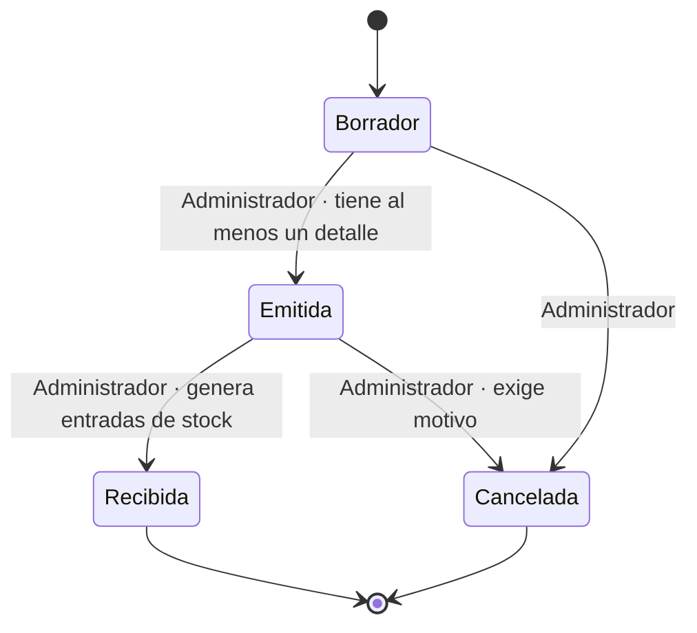

# Máquina de estados — Orden de compra

Módulo de negocio: **Inventario**. Entidad central: **`OrdenCompra`** (atributo `Estado`).

Entidades del módulo (RF-NEG-01): `Producto`, `Proveedor`, `OrdenCompra` (+ `DetalleOrdenCompra`) y `MovimientoStock`.

## Dónde está en el código

| Qué | Dónde |
|---|---|
| Estados (RF-NEG-03) — único lugar | `src/Negocio/Estados/EstadoOrdenCompra.cs` |
| Transiciones permitidas (RD-04) — único lugar | `src/Negocio/Estados/TransicionesOrdenCompra.cs` → método `Puede(desde, hacia)` |
| Entidad central con su estado | `src/Negocio/Dominio/OrdenCompra.cs` |

## Estados

| Estado | Descripción | ¿Terminal? |
|---|---|---|
| `Borrador` | Orden en preparación; se pueden agregar o quitar detalles. Estado inicial. | No |
| `Emitida` | Orden enviada al proveedor; ya no se editan los detalles. | No |
| `Recibida` | La mercancía llegó y se registró la entrada al inventario. | **Sí** (RF-NEG-05) |
| `Cancelada` | La orden se anuló y no tendrá efecto en el inventario. | **Sí** (RF-NEG-05) |

## Tabla de transiciones

| Desde | Hacia | Quién la ejecuta | Condición |
|---|---|---|---|
| Borrador | Emitida | Administrador | La orden tiene al menos un detalle con cantidad mayor que cero. |
| Borrador | Cancelada | Administrador | — |
| Emitida | Recibida | Administrador | Se generan los movimientos de stock de entrada de cada detalle. |
| Emitida | Cancelada | Administrador | Se exige un motivo de cancelación. |
| Recibida | Cancelada | — | **Prohibida** (RF-NEG-04): la mercancía ya entró al inventario. El sistema la rechaza y el estado no cambia. |
| Borrador | Recibida | — | **Prohibida** (RF-NEG-04): no se puede recibir una orden que nunca se emitió. El sistema la rechaza y el estado no cambia. |
| Recibida | *(cualquiera)* | — | **Prohibida**: estado terminal. |
| Cancelada | *(cualquiera)* | — | **Prohibida**: estado terminal. |

Cualquier par que no aparezca como permitido en `TransicionesOrdenCompra` está prohibido.

## Diagrama

> Las pruebas de la máquina de estados llegan en la semana 8. Esta máquina es independiente de la de
> Gestión de permisos (RF-NEG-09).
